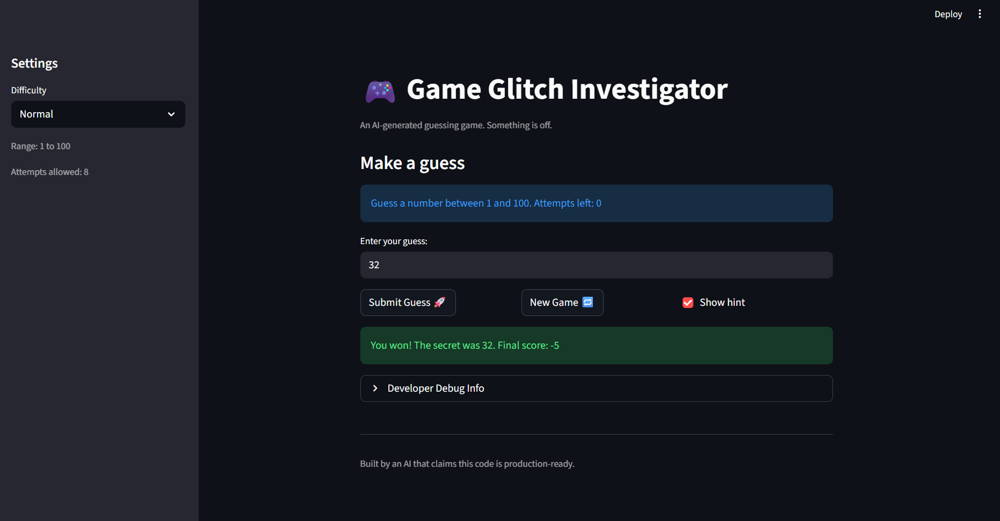
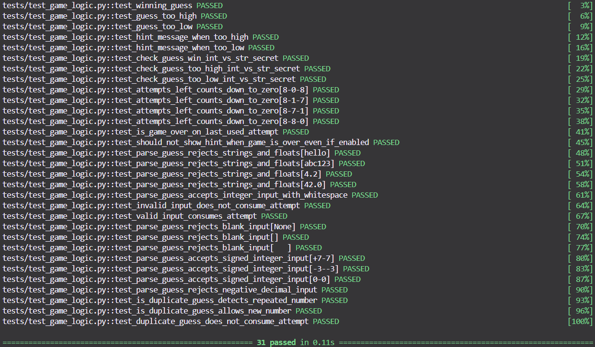

# 🎮 Game Glitch Investigator: The Impossible Guesser

## 🚨 The Situation

You asked an AI to build a simple "Number Guessing Game" using Streamlit.
It wrote the code, ran away, and now the game is unplayable. 

- You can't win.
- The hints lie to you.
- The secret number seems to have commitment issues.

## 🛠️ Setup

1. Install dependencies: `pip install -r requirements.txt`
2. Run the broken app: `python -m streamlit run app.py`

## 🕵️‍♂️ Your Mission

1. **Play the game.** Open the "Developer Debug Info" tab in the app to see the secret number. Try to win.
2. **Find the State Bug.** Why does the secret number change every time you click "Submit"? Ask ChatGPT: *"How do I keep a variable from resetting in Streamlit when I click a button?"*
3. **Fix the Logic.** The hints ("Higher/Lower") are wrong. Fix them.
4. **Refactor & Test.** - Move the logic into `logic_utils.py`.
   - Run `pytest` in your terminal.
   - Keep fixing until all tests pass!

## 📝 Document Your Experience

- [The purpose of this game is for a user to guess within a range of numbers a secret number with a limited amount of attempts and if they can test their luck in discovering the number with many attempt to spare.] Describe the game's purpose.
- [The bugs that I had discovered as a resulting of viewing the game for the first time and playing it were that the hints were inaccurate as I was trying to discover the hidden number. Another bug would be that whenever I wanted to play a new game out of interest, the game being over, or change the difficulty to play a new game, it would freeze, making the game unplayable. Also, strings along with floats were accepted inputs in the game, but the secret number is an integer, though the float could truncate, it isn't accurate and wastes attempts. Also, when you change the difficulty of the game, it shows its amount of attempts but not the correct range of numbers to select from, it remains the range of numbers of normal difficulty.] Detail which bugs you found.
- [The fixes I applied was to have the guesses be more accurate so that the player can be certain of how close they are to correctly guess the secret number. Also, I fixed the ability of the game to not freeze when the player decides to play a new game. Also, another fix would be that inputs be integers and cannot be floats nor strings. Also, a fix would be that the number of attempts would be accurate and if the player continues to make attempts even after the game is over, it will make sure to inform the player that the game is already over and they should play a new game.] Explain what fixes you applied.

## 📸 Demo

- [ ] [Insert a screenshot of your fixed, winning game here]
- [] [ Advanced Edge-Case Testing]
## 🚀 Stretch Features

- [ ] [If you choose to complete Challenge 4, insert a screenshot of your Enhanced Game UI here]
