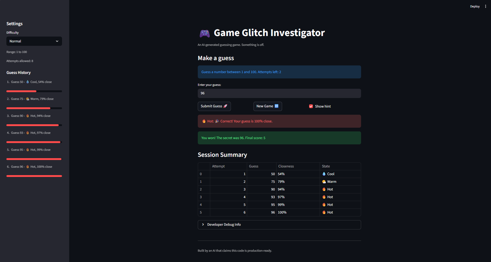

# 🎮 Game Glitch Investigator: The Impossible Guesser

## 🚨 The Situation

You asked an AI to build a simple "Number Guessing Game" using Streamlit.
It wrote the code, ran away, and now the game is unplayable. 

- You can't win.
- The hints lie to you.
- The secret number seems to have commitment issues.

## 🛠️ Setup

1. Install dependencies: `pip install -r requirements.txt`
2. Run the broken app: `python -m streamlit run app.py`

## 🕵️‍♂️ Your Mission

1. **Play the game.** Open the "Developer Debug Info" tab in the app to see the secret number. Try to win.
2. **Find the State Bug.** Why does the secret number change every time you click "Submit"? Ask ChatGPT: *"How do I keep a variable from resetting in Streamlit when I click a button?"*
3. **Fix the Logic.** The hints ("Higher/Lower") are wrong. Fix them.
4. **Refactor & Test.** - Move the logic into `logic_utils.py`.
   - Run `pytest` in your terminal.
   - Keep fixing until all tests pass!

## 📝 Document Your Experience

- [The purpose of this game is for a user to guess within a range of numbers a secret number with a limited amount of attempts and if they can test their luck in discovering the number with many attempt to spare.] Describe the game's purpose.
- [The bugs that I had discovered as a resulting of viewing the game for the first time and playing it were that the hints were inaccurate as I was trying to discover the hidden number. Another bug would be that whenever I wanted to play a new game out of interest, the game being over, or change the difficulty to play a new game, it would freeze, making the game unplayable. Also, strings along with floats were accepted inputs in the game, but the secret number is an integer, though the float could truncate, it isn't accurate and wastes attempts. Also, when you change the difficulty of the game, it shows its amount of attempts but not the correct range of numbers to select from, it remains the range of numbers of normal difficulty.] Detail which bugs you found.
- [The fixes I applied was to have the guesses be more accurate so that the player can be certain of how close they are to correctly guess the secret number. Also, I fixed the ability of the game to not freeze when the player decides to play a new game. Also, another fix would be that inputs be integers and cannot be floats nor strings. Also, a fix would be that the number of attempts would be accurate and if the player continues to make attempts even after the game is over, it will make sure to inform the player that the game is already over and they should play a new game.] Explain what fixes you applied.

## 📸 Demo

### Enhanced Game UI

This screenshot shows the color-coded Hot/Cold hint, guess history sidebar, and session summary table:



### Advanced Edge-Case Testing

================================================ test session starts ================================================
platform win32 -- Python 3.14.3, pytest-9.0.2, pluggy-1.6.0 -- C:\Users\Qures\OneDrive\Documents\CodePath Project One\ai110-module1show-gameglitchinvestigator-starter\.venv\Scripts\python.exe
cachedir: .pytest_cache
rootdir: C:\Users\Qures\OneDrive\Documents\CodePath Project One\ai110-module1show-gameglitchinvestigator-starter
collected 41 items                                                                                                   
tests/test_game_logic.py::test_winning_guess PASSED                                                            [  2%]
tests/test_game_logic.py::test_guess_too_high PASSED                                                           [  4%]
tests/test_game_logic.py::test_guess_too_low PASSED                                                            [  7%]
tests/test_game_logic.py::test_hint_message_when_too_high PASSED                                               [  9%]
tests/test_game_logic.py::test_hint_message_when_too_low PASSED                                                [ 12%]
tests/test_game_logic.py::test_check_guess_win_int_vs_str_secret PASSED                                        [ 14%]
tests/test_game_logic.py::test_check_guess_too_high_int_vs_str_secret PASSED                                   [ 17%]
tests/test_game_logic.py::test_check_guess_too_low_int_vs_str_secret PASSED                                    [ 19%]
tests/test_game_logic.py::test_check_guess_compares_string_secret_numerically PASSED                           [ 21%]
tests/test_game_logic.py::test_attempts_left_counts_down_to_zero[8-0-8] PASSED                                 [ 24%]
tests/test_game_logic.py::test_attempts_left_counts_down_to_zero[8-1-7] PASSED                                 [ 26%]
tests/test_game_logic.py::test_attempts_left_counts_down_to_zero[8-7-1] PASSED                                 [ 29%]
tests/test_game_logic.py::test_attempts_left_counts_down_to_zero[8-8-0] PASSED                                 [ 31%]
tests/test_game_logic.py::test_is_game_over_on_last_used_attempt PASSED                                        [ 34%]
tests/test_game_logic.py::test_should_not_show_hint_when_game_is_over_even_if_enabled PASSED                   [ 36%]
tests/test_game_logic.py::test_guess_closeness_percent_exact_guess PASSED                                      [ 39%]
tests/test_game_logic.py::test_guess_closeness_percent_far_guess PASSED                                        [ 41%]
tests/test_game_logic.py::test_guess_closeness_percent_clamps_out_of_range_guess PASSED                        [ 43%]
tests/test_game_logic.py::test_guess_temperature_label[100-Hot] PASSED                                         [ 46%]
tests/test_game_logic.py::test_guess_temperature_label[85-Hot] PASSED                                          [ 48%]
tests/test_game_logic.py::test_guess_temperature_label[60-Warm] PASSED                                         [ 51%]
tests/test_game_logic.py::test_guess_temperature_label[30-Cool] PASSED                                         [ 53%]
tests/test_game_logic.py::test_guess_temperature_label[0-Cold] PASSED                                          [ 56%]
tests/test_game_logic.py::test_build_guess_summary_returns_table_ready_rows PASSED                             [ 58%]
tests/test_game_logic.py::test_parse_guess_rejects_strings_and_floats[hello] PASSED                            [ 60%]
tests/test_game_logic.py::test_parse_guess_rejects_strings_and_floats[abc123] PASSED                           [ 63%]
tests/test_game_logic.py::test_parse_guess_rejects_strings_and_floats[4.2] PASSED                              [ 65%]
tests/test_game_logic.py::test_parse_guess_rejects_strings_and_floats[42.0] PASSED                             [ 68%]
tests/test_game_logic.py::test_parse_guess_accepts_integer_input_with_whitespace PASSED                        [ 70%]
tests/test_game_logic.py::test_invalid_input_does_not_consume_attempt PASSED                                   [ 73%]
tests/test_game_logic.py::test_valid_input_consumes_attempt PASSED                                             [ 75%]
tests/test_game_logic.py::test_parse_guess_rejects_blank_input[None] PASSED                                    [ 78%]
tests/test_game_logic.py::test_parse_guess_rejects_blank_input[] PASSED                                        [ 80%]
tests/test_game_logic.py::test_parse_guess_rejects_blank_input[   ] PASSED                                     [ 82%]
tests/test_game_logic.py::test_parse_guess_accepts_signed_integer_input[+7-7] PASSED                           [ 85%]
tests/test_game_logic.py::test_parse_guess_accepts_signed_integer_input[-3--3] PASSED                          [ 87%]
tests/test_game_logic.py::test_parse_guess_accepts_signed_integer_input[0-0] PASSED                            [ 90%]
tests/test_game_logic.py::test_parse_guess_rejects_negative_decimal_input PASSED                               [ 92%]
tests/test_game_logic.py::test_is_duplicate_guess_detects_repeated_number PASSED                               [ 95%]
tests/test_game_logic.py::test_is_duplicate_guess_allows_new_number PASSED                                     [ 97%]
tests/test_game_logic.py::test_duplicate_guess_does_not_consume_attempt PASSED                                 [100%]

================================================ 41 passed in 0.17s =================================================

## 🚀 Stretch Features

- [ ] [If you choose to complete Challenge 4, insert a screenshot of your Enhanced Game UI here]

## UI Enhancements Added

The game now gives more structured and user-friendly feedback after each valid guess:

- `guess_temperature_label()` in `logic_utils.py` maps the closeness score into Hot, Warm, Cool, or Cold states with an emoji and Streamlit message style.
- `build_guess_summary()` in `logic_utils.py` creates table-ready rows with the attempt number, guess value, percent closeness, and Hot/Cold state.
- `render_guess_history_sidebar()` in `app.py` displays each previous guess in the sidebar with a progress bar and Hot/Cold label.
- `render_session_summary()` in `app.py` outputs a session summary table below the main controls so players can review their full round.
- The submit handler in `app.py` combines the original higher/lower hint from `check_guess()` with the Hot/Cold state and percent closeness, then displays it with `st.error`, `st.warning`, or `st.info` depending on how close the guess was.

These changes are presentation-focused and do not change the core game rules, scoring logic, attempt counting, or input validation.

## Run This Project From GitHub

Anyone can clone the repository, install dependencies, run the tests, and start the Streamlit app with these commands:

```powershell
git clone https://github.com/Aqureshi106/ai110-module1show-gameglitchinvestigator-starter.git
cd ai110-module1show-gameglitchinvestigator-starter
python -m venv .venv
.\.venv\Scripts\python.exe -m pip install -r requirements.txt
.\.venv\Scripts\python.exe -m pytest -q
.\.venv\Scripts\python.exe -m streamlit run app.py
```

## Advanced Edge-Case Testing

Run the full pytest suite from inside the project folder:

```powershell
.\.venv\Scripts\python.exe -m pytest -q
```
